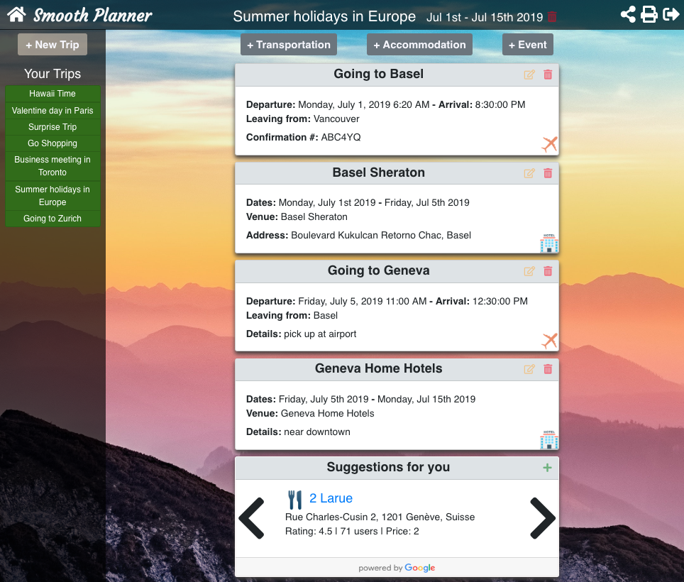
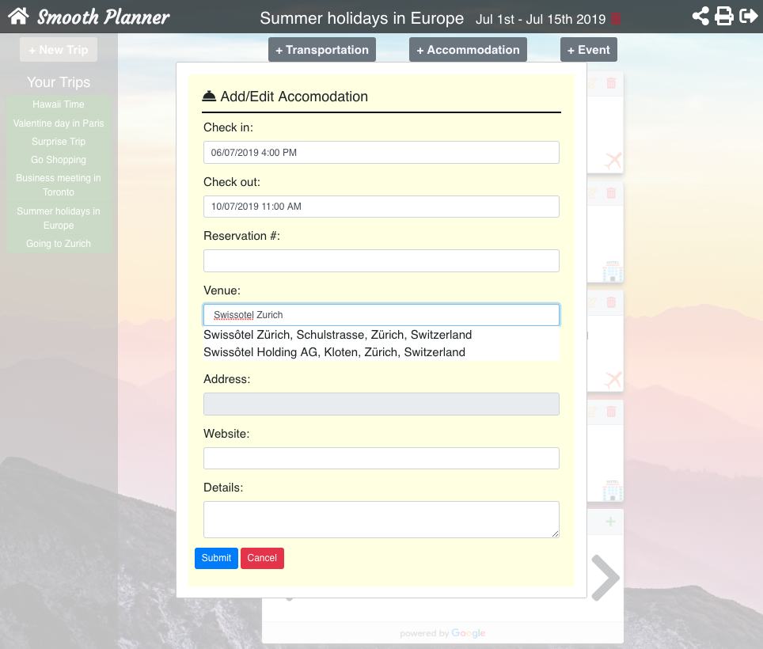

# Travel App - Smooth Planner

# Project Description
There are lots of decisions to be made while planning a trip - where to stay, which transportation option to use, what activities to do at the destination etc
Our app aims to simplify travelling and alleviate some of the stress associated with it.
- It simplifies planning by allowing users to save all details connected to trip at one location. 
- It lets users collaborate by sharing their trips with others
- It suggests recommendations on things to do at the destination

# Target Audience
The app will be useful for business or leisure travellers looking for a simple way to organise their itineraries.

# Tech Stack
- PostgresSQL
- Rails
- React

# Screenshots
## A planned trip in Smooth Planner

## Form linked with the Google API

# Features
- Itinerary in one place: Add all details related to your trip at one place in three types of cards -
        * Transport
        * Accomodation
        * Miscellaneous events / activities
- Easy Edits: Travel planning is a fluid exercise and if plans change, easily edit the details on the cards
- Collaboration: Add users to the trip to allow them access to view and edit their trip
- Suggestions: Integrated with the Google places API the app automatically suggests things to do and restaurants in the destination. The suggestions can be easily integrated into the itinerary

# Dependencies
- Client Side:
   * Axios
   * JQuery
   * MomentJS
   * React-datepicker
   * React-modal
   * React-places-autocomplete
   * React-router-dom

- Server Side
  * http
  * puma
  * rack-cors

# Project Directory

1. smooth_planner_react - Client side files
2. smooth_planner_api - Server side files
3. project_planning - Project planning docs including user stories, ERD and wireframes

# Project Setup
1. Client Side Setup
  - Run npm install in the smooth_planner_react folder
  - set up the .env file as shown in the example
  - Open [http://localhost:3000](http://localhost:3000) to view it in the browser

2. Server Side Setup
  - Run bundle install in the smooth_planner_api folder
  - Sign up for the Google API key and set up the secrets.yml file as shown in the example
  - Run rails s -b 0.0.0.0 -p 3001 to run the server

# Future features
This app is a work in progress. The next features we will build are - 
1. Uploading documents: Allow users to upload tickets/reservation confirmations to the itinerary
2. Email: Allow users to email a copy of the itinerary to themselves.

# Team Members
Clive [@silentscribe](https://github.com/silentscribe)
Sumedha [@sumedhan](https://github.com/sumedhan)
Tony [@tonykieling](https://github.com/tonykieling)
